# EcoTrack — New Features Implementation Plan

**Date:** March 14, 2026  
**Based on:** Full project audit of current codebase

---

## Current State Assessment

The project has evolved significantly since the original roadmap. Here is the updated status:

### What Is Now Fully Working ✅

| Area | Details |
|------|---------|
| **JWT Authentication** | `SecurityConfig`, `JwtUtil`, `JwtAuthFilter` — BCrypt hashing, Bearer token auth |
| **User Management** | Signup, login, CRUD, admin stats, account status, password reset |
| **Waste Tracking** | Full CRUD, status transitions, 5 validation rules, analytics, trends |
| **AI Waste Classification** | Image classification via Groq API with confidence scoring |
| **Facilities** | CRUD, nearest facility via Haversine, data initializer |
| **Communities** | Create/join/leave, leaderboard, stats, search |
| **Notifications** | Model + repo + controller + service — CRUD, mark read, unread count |
| **Education** | Controller for get all, by category, featured, by ID with view tracking |
| **Marketplace** | Controller for CRUD — browse, filter by category, seller listings, create/update/delete |
| **Rewards & Badges** | Points calculation, badge checking/awarding, reward redemption |
| **Settings** | User settings persistence — theme, notifications, sound, privacy |
| **Support Tickets** | Submit and fetch tickets per user |
| **File Upload** | Waste image upload with validation |
| **Admin Panel** | 7 sub-screens — overview, users, collectors, waste, analytics, facilities, communities |
| **Onboarding** | Role-aware wizard for Donor and Collector |
| **Forgot Password** | Frontend screen + backend endpoint |
| **20+ Frontend Screens** | All wired to real API with JWT tokens |

### What Still Has Gaps ⚠️

| Gap | Current State | Impact |
|-----|--------------|--------|
| No RBAC in SecurityConfig | Auth checks `authenticated` only, not role-based | Any logged-in user can hit admin endpoints |
| No `@Transactional` | Multi-step DB ops can leave inconsistent state | Data integrity risk |
| No backend tests | Only `BackendApplicationTests` placeholder + accuracy test | No safety net for changes |
| Education admin CRUD | Controller has read-only endpoints | Admins cannot create/update/delete content |
| No search endpoints | No full-text search on education/marketplace | Users cannot search content |
| WasteTrackingController 53KB | All logic in one controller file | Hard to maintain |
| README.md merge conflict | Still has `<<<<<<< HEAD` markers | Unprofessional |
| Groq API key in properties | Hardcoded API key | Security risk |
| No dark mode implementation | Settings toggle exists, but no theme CSS | Toggle does nothing |
| `RoleGuard` unused | Component exists but never used in routes | Role-based access not enforced on frontend |
| No pagination | All list endpoints return all records | Performance degrades with data growth |

---

## Feature Proposals — Grouped by Category

### Category A: Fix & Harden Existing Features

#### A1. Role-Based Access Control on Backend
**Scope:** Backend  
**Files to modify:** [`SecurityConfig.java`](backend/src/main/java/com/ecotrack/backend/security/SecurityConfig.java)  
- Add role-based matchers: admin-only for `/api/users/admin/**`, collector-only for pickup status updates
- Extract role from JWT claims in `JwtAuthFilter`
- Add `@PreAuthorize` annotations on sensitive controller methods

#### A2. Add `@Transactional` to Multi-Step Operations
**Scope:** Backend  
**Files to modify:** [`UserController.java`](backend/src/main/java/com/ecotrack/backend/controller/UserController.java), [`WasteTrackingController.java`](backend/src/main/java/com/ecotrack/backend/controller/WasteTrackingController.java), [`CommunityController.java`](backend/src/main/java/com/ecotrack/backend/controller/CommunityController.java)  
- Wrap `deleteUser`, `updateWasteStatus`, `joinCommunity`, `leaveCommunity` in `@Transactional`

#### A3. Enforce Frontend Role-Based Route Guards
**Scope:** Frontend  
**Files to modify:** [`routes.tsx`](src/app/routes.tsx)  
- Wrap donor-only routes with `RoleGuard allowedRoles=DONOR`
- Wrap collector-only routes with `RoleGuard allowedRoles=COLLECTOR`
- Prevent unauthorized navigation

#### A4. Education Admin CRUD Endpoints
**Scope:** Backend  
**Files to modify:** [`EducationController.java`](backend/src/main/java/com/ecotrack/backend/controller/EducationController.java)  
- Add `POST /api/education` — create content — Admin only
- Add `PUT /api/education/{id}` — update content — Admin only
- Add `DELETE /api/education/{id}` — delete content — Admin only

#### A5. Pagination for List Endpoints
**Scope:** Backend + Frontend  
- Add `page` and `size` query params to `/api/waste`, `/api/marketplace`, `/api/education`, `/api/notifications`
- Return `Page` objects from Spring Data
- Add infinite scroll or pagination UI in frontend list screens

#### A6. Fix README.md Merge Conflicts
**Scope:** Documentation  
**Files to modify:** [`README.md`](README.md)  
- Remove merge conflict markers
- Write proper project description, setup instructions, tech stack

#### A7. Secure Sensitive Configuration
**Scope:** Backend  
**Files to modify:** [`application.properties`](backend/src/main/resources/application.properties)  
- Move Groq API key, JWT secret, and DB password to environment variables
- Add `.env.example` for documentation
- Update README with env setup instructions

---

### Category B: UX & Frontend Enhancements

#### B1. Dark Mode Implementation
**Scope:** Frontend  
- Create a `ThemeProvider` component using CSS variables
- Toggle between light/dark themes based on Settings
- Persist preference via [`settingsAPI`](src/app/services/apiService.ts:254)
- Apply to all screens via Tailwind `dark:` classes

#### B2. Skeleton Loading States
**Scope:** Frontend  
- Replace spinner-only loading with content-shaped skeleton placeholders
- Apply to HomeScreen, MarketplaceScreen, EducationScreen, notifications list
- Better perceived performance

#### B3. Pull-to-Refresh / Manual Refresh
**Scope:** Frontend  
- Add a visible refresh button or pull gesture on key screens
- HomeScreen, CollectorDashboardScreen, DonationTrackingScreen already poll — add manual trigger too

#### B4. Notification Badge in Navigation
**Scope:** Frontend  
**Files to modify:** [`RootLayout.tsx`](src/app/layouts/RootLayout.tsx)  
- Fetch unread notification count via `notificationAPI.getUnreadCount`
- Display a red badge on the Profile nav icon
- Auto-refresh count periodically

#### B5. Image Compression Before Upload
**Scope:** Frontend  
- Compress waste photos on the client side before uploading to reduce bandwidth
- Use Canvas API or a library like `browser-image-compression`
- Apply to [`TrackWasteScreen.tsx`](src/app/screens/TrackWasteScreen.tsx), [`CollectorPickupsScreen.tsx`](src/app/screens/CollectorPickupsScreen.tsx)

#### B6. PWA Support
**Scope:** Frontend  
- Add a `manifest.json` and service worker
- Enable install prompt on mobile browsers
- Cache static assets for faster loads
- Optional: offline read support for cached data

---

### Category C: New Feature Modules

#### C1. Waste Recycling Challenges & Events
**Scope:** Full Stack  
**Description:** Community-driven challenges where users compete to recycle the most in a time period.

**Backend:**
- New entity: `Challenge` — title, description, startDate, endDate, targetKg, communityId
- New entity: `ChallengeParticipant` — userId, challengeId, contributedKg
- Endpoints: create challenge, join, view leaderboard, check results
- Auto-calculate winners when challenge ends

**Frontend:**
- New screen: `ChallengesScreen.tsx` — browse active/past challenges
- Challenge detail view with progress bar and leaderboard
- Join/leave challenge from community screen

#### C2. In-App Messaging Between Donor & Collector
**Scope:** Full Stack  
**Description:** Allow donors and collectors to communicate during a pickup lifecycle.

**Backend:**
- New entity: `Message` — senderId, receiverId, wasteId, content, createdAt, readAt
- Endpoints: send message, get conversation by wasteId, mark read
- Messages only allowed for active pickups — IN_PROGRESS status

**Frontend:**
- Chat bubble on DonationTrackingScreen — open conversation for a specific pickup
- Chat bubble on CollectorPickupsScreen — message donor about a claimed pickup
- Real-time feel via polling or WebSocket

#### C3. Collector Rating & Feedback System
**Scope:** Full Stack  
**Description:** After a pickup is completed, donors can rate and review collectors.

**Backend:**
- New entity: `CollectorRating` — donorId, collectorId, wasteId, rating 1-5, comment, createdAt
- Endpoints: submit rating, get collector ratings, average rating
- Only one rating per wasteId — prevent duplicates
- Add average rating field to User model for collectors

**Frontend:**
- Rating dialog appears on DonationTrackingScreen after status changes to COLLECTED
- Collector profile shows average rating and recent reviews
- Star rating component with optional text feedback

#### C4. Waste Calendar & Scheduling View
**Scope:** Full Stack  
**Description:** Calendar view showing past and upcoming waste pickups.

**Backend:**
- Already have `WastePickup` entity with `scheduledDate`
- Add endpoint: `GET /api/waste/calendar?userId={id}&month={YYYY-MM}` — returns waste entries grouped by date

**Frontend:**
- New screen or tab: `CalendarView`
- Monthly calendar with dots indicating waste entries
- Click a date to see that day's entries
- Color-coded by status: green for collected, yellow for in-progress, red for pending

#### C5. Data Export — CSV & PDF Reports
**Scope:** Full Stack  
**Description:** Allow users to download their waste history and analytics as reports.

**Backend:**
- New endpoint: `GET /api/waste/export/csv?userId={id}&timeRange=month`
- New endpoint: `GET /api/waste/export/pdf?userId={id}&timeRange=month`
- Use Apache POI or OpenCSV for CSV, iText or Jasper for PDF

**Frontend:**
- Export button on AnalyticsScreen
- Download button on ProfileScreen for personal data export
- Admin: bulk export for platform statistics

#### C6. Carbon Footprint Dashboard
**Scope:** Frontend (backend data already available)  
**Description:** Dedicated visualization of CO₂ impact with rich charts and comparisons.

**Frontend:**
- New screen or section in AnalyticsScreen
- Tree-equivalence visualization — how many trees your recycling saved
- Monthly CO₂ trend chart
- Comparison with average user
- Impact equivalence — miles not driven, phones charged, etc.

#### C7. Achievement Streaks
**Scope:** Full Stack  
**Description:** Track daily/weekly waste logging streaks to encourage consistent behavior.

**Backend:**
- Add streak fields to User model: `currentStreak`, `longestStreak`, `lastLogDate`
- Service logic: increment streak on waste creation if consecutive days
- Endpoint: `GET /api/users/{id}/streak`

**Frontend:**
- Streak counter on HomeScreen and ProfileScreen
- Flame/fire emoji animation for active streaks
- Streak milestone badges — 7-day, 30-day, 100-day

#### C8. Multi-Language Support — i18n
**Scope:** Frontend  
**Description:** Internationalize the app for multiple languages.

- Use `react-i18next` or similar library
- Extract all UI strings to translation files
- Start with English, Hindi, Tamil
- Language selector in Settings screen
- Persist language preference via settingsAPI

---

### Category D: DevOps & Code Quality

#### D1. Backend Unit & Integration Tests
**Scope:** Backend  
- JUnit 5 tests for all services: `WastePriorityService`, `FacilityMatchingService`, `WasteValidationService`, `NotificationService`
- MockMvc tests for controllers: `UserController`, `WasteTrackingController`
- Test JWT authentication flow
- Minimum target: 60% line coverage

#### D2. Frontend Tests
**Scope:** Frontend  
- Set up Vitest + React Testing Library
- Unit tests for apiService helper functions
- Component tests for key screens: LoginScreen, TrackWasteScreen
- Integration tests for auth flow

#### D3. API Documentation with Swagger/OpenAPI
**Scope:** Backend  
- Add `springdoc-openapi-starter-webmvc-ui` dependency
- Annotate controllers with `@Operation`, `@Parameter`, `@ApiResponse`
- Auto-generated API docs at `/swagger-ui.html`
- Useful for frontend devs and external integrators

#### D4. Refactor WasteTrackingController
**Scope:** Backend  
- Extract analytics logic into `WasteAnalyticsService`
- Extract status transition logic into `WasteStatusService`
- Extract CO₂ calculations into `CarbonCalculationService`
- Controller becomes a thin delegate layer

#### D5. Docker Compose Setup
**Scope:** DevOps  
- Create `Dockerfile` for Spring Boot backend
- Create `Dockerfile` for Vite frontend
- Create `docker-compose.yml` with backend + frontend + PostgreSQL
- Add volume mounts for uploads and DB data
- README instructions for Docker startup

#### D6. CI/CD with GitHub Actions
**Scope:** DevOps  
- Workflow: build backend, run tests
- Workflow: build frontend, run lint + tests
- Trigger on push to main and PR branches
- Optional: deploy to cloud on merge to main

#### D7. Database Migrations with Flyway
**Scope:** Backend  
- Replace `hibernate.ddl-auto=update` with Flyway-managed migrations
- Create initial migration script from current schema
- Safer for production — controlled, versioned schema changes

---

## Prioritized Implementation Order

```mermaid
flowchart TD
    A[Category A: Fix and Harden] --> B[Category B: UX Enhancements]
    A --> D[Category D: DevOps and Quality]
    B --> C[Category C: New Features]
    D --> C

    A1[A1 RBAC on Backend] --> A3[A3 Frontend Role Guards]
    A2[A2 Transactional] --> D1[D1 Backend Tests]
    A4[A4 Education Admin CRUD] --> B2[B2 Skeleton Loading]
    A5[A5 Pagination] --> B5[B5 Image Compression]
    A6[A6 Fix README] --> D3[D3 Swagger Docs]
    A7[A7 Secure Config] --> D5[D5 Docker Setup]
    
    B1[B1 Dark Mode] --> C8[C8 i18n]
    B4[B4 Notification Badge] --> C2[C2 In-App Messaging]
    B6[B6 PWA] --> C5[C5 Data Export]
    
    C1[C1 Challenges] --> C7[C7 Achievement Streaks]
    C3[C3 Collector Rating] --> C2
    C4[C4 Waste Calendar] --> C5
    C6[C6 Carbon Dashboard] --> C5
```

### Recommended Execution Sequence

**Phase 1 — Hardening** — Fix critical gaps before adding features
1. A1 — RBAC on Backend
2. A2 — `@Transactional` annotations
3. A3 — Frontend Role Guards
4. A6 — Fix README.md
5. A7 — Secure sensitive configuration

**Phase 2 — Developer Experience** — Make the codebase maintainable
6. D4 — Refactor WasteTrackingController
7. D1 — Backend Unit/Integration Tests
8. D3 — Swagger/OpenAPI Documentation
9. A4 — Education Admin CRUD Endpoints
10. A5 — Pagination for List Endpoints

**Phase 3 — UX Polish** — Improve user experience
11. B1 — Dark Mode Implementation
12. B2 — Skeleton Loading States
13. B4 — Notification Badge in Navigation
14. B5 — Image Compression Before Upload
15. B3 — Pull-to-Refresh

**Phase 4 — New Features** — High-impact new modules
16. C3 — Collector Rating & Feedback
17. C4 — Waste Calendar
18. C7 — Achievement Streaks
19. C6 — Carbon Footprint Dashboard
20. C1 — Challenges & Events

**Phase 5 — Advanced Features** — Differentiation features
21. C2 — In-App Messaging
22. C5 — Data Export — CSV/PDF
23. C8 — Multi-Language Support
24. B6 — PWA Support

**Phase 6 — Production Readiness** — Deployment prep
25. D5 — Docker Compose
26. D6 — CI/CD Pipeline
27. D7 — Database Migrations with Flyway
28. D2 — Frontend Tests

---

## Summary

| Category | Count | Focus |
|----------|-------|-------|
| A — Fix & Harden | 7 items | Security, data integrity, cleanup |
| B — UX Enhancements | 6 items | Dark mode, loading states, PWA |
| C — New Features | 8 items | Challenges, messaging, ratings, calendar |
| D — DevOps & Quality | 7 items | Tests, docs, Docker, CI/CD |
| **Total** | **28 items** | |
