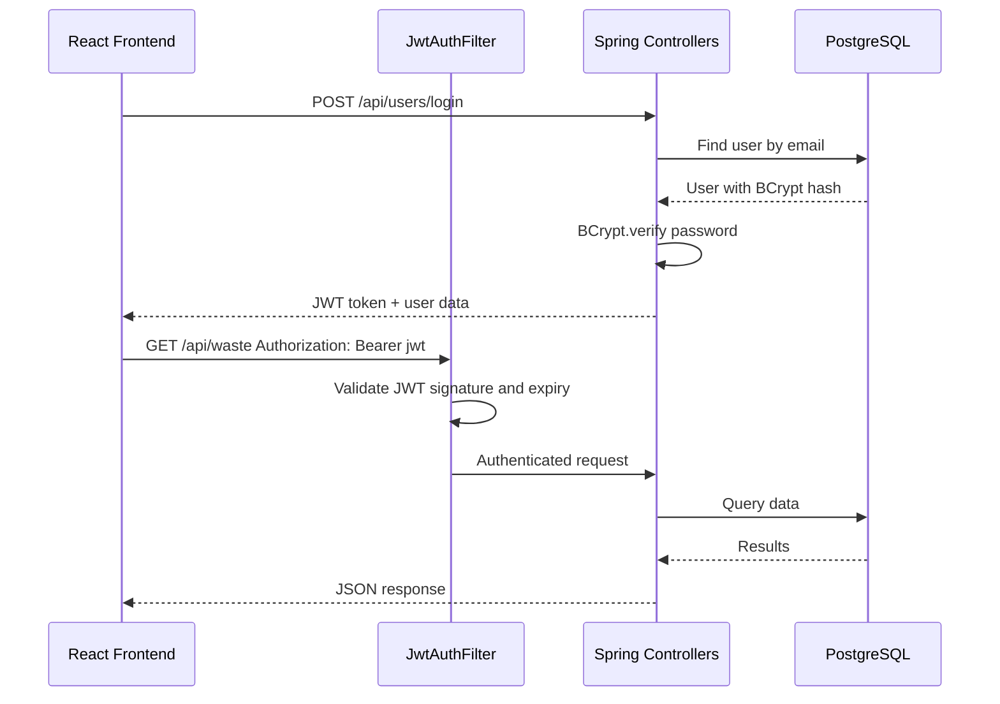
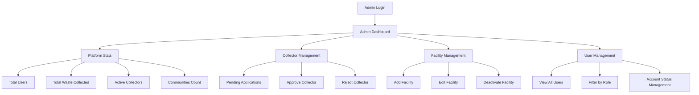
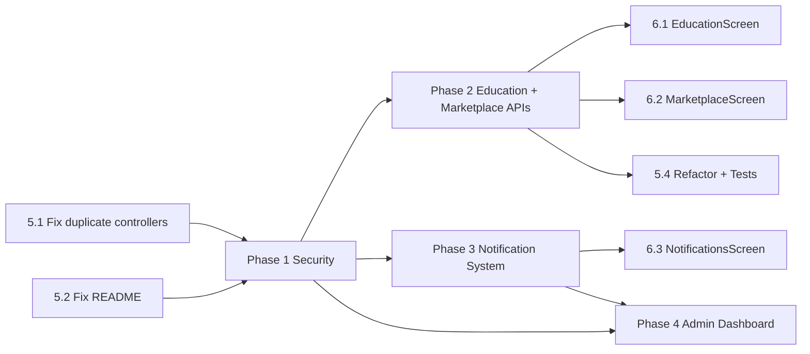

# EcoTrack Comprehensive Implementation Roadmap

## Current State Summary

### Backend - Spring Boot 4.0.1 + PostgreSQL
| Component | Status |
|-----------|--------|
| User CRUD + Auth | ✅ Working — plain-text passwords, no JWT |
| Waste Tracking | ✅ Working — full CRUD, status transitions, validation |
| Waste Analytics | ✅ Working — user, collector, global, trends |
| Facilities | ✅ Working — CRUD, nearest facility |
| Communities | ✅ Working — create, join, leave, stats, leaderboard |
| File Upload | ✅ Working — waste image upload |
| Education Content | ❌ Model + repo exist, **NO controller** |
| Marketplace Items | ❌ Model + repo exist, **NO controller** |
| Notifications | ❌ Nothing exists — no model, repo, or controller |
| Security | ❌ No Spring Security, no JWT, no BCrypt |

### Frontend - React + Vite + TailwindCSS + Radix UI
| Screen | API Integrated? |
|--------|----------------|
| LoginScreen | ✅ Yes |
| SignupScreen | ✅ Yes |
| HomeScreen | ✅ Yes |
| TrackWasteScreen | ✅ Yes |
| LocationsScreen | ✅ Yes |
| ProfileScreen | ✅ Yes |
| AnalyticsScreen | ✅ Yes |
| CommunityScreen | ✅ Yes |
| CollectorDashboardScreen | ✅ Yes |
| CollectorPickupsScreen | ✅ Yes |
| CollectorRoutesScreen | ✅ Yes |
| CollectorHistoryScreen | ✅ Yes |
| DonationTrackingScreen | ✅ Yes |
| SettingsScreen | ⚠️ Partial — delete account works, settings not persisted |
| **EducationScreen** | ❌ **Hardcoded data** |
| **MarketplaceScreen** | ❌ **Hardcoded data** |
| **NotificationsScreen** | ❌ **Hardcoded data** |
| OnboardingScreen | ⚠️ Static — no dynamic data needed |
| HelpScreen | ⚠️ Static — FAQ content |

### Known Code Issues
- **Duplicate controller mappings**: `WasteController` and `FacilityController` both map to `/api/waste`
- **README.md** has unresolved Git merge conflict markers
- **No unit/integration tests** — only a placeholder test file
- **Passwords stored in plain text** — `findByEmailAndPassword()` compares raw strings
- **No `@Transactional`** on multi-step operations in UserController delete

---

## Phase 1 — Security and Authentication

### Goal
Protect the API with JWT-based authentication and BCrypt password hashing while keeping the system backward-compatible during migration.

### 1.1 Add Spring Security + JWT Dependencies

**File to modify**: [`pom.xml`](backend/pom.xml)

Add these dependencies:
```xml
<dependency>
    <groupId>org.springframework.boot</groupId>
    <artifactId>spring-boot-starter-security</artifactId>
</dependency>
<dependency>
    <groupId>io.jsonwebtoken</groupId>
    <artifactId>jjwt-api</artifactId>
    <version>0.12.6</version>
</dependency>
<dependency>
    <groupId>io.jsonwebtoken</groupId>
    <artifactId>jjwt-impl</artifactId>
    <version>0.12.6</version>
    <scope>runtime</scope>
</dependency>
<dependency>
    <groupId>io.jsonwebtoken</groupId>
    <artifactId>jjwt-jackson</artifactId>
    <version>0.12.6</version>
    <scope>runtime</scope>
</dependency>
```

### 1.2 Backend Files to Create

| File | Purpose |
|------|---------|
| `backend/src/main/java/com/ecotrack/backend/security/JwtUtils.java` | JWT token generation, validation, parsing |
| `backend/src/main/java/com/ecotrack/backend/security/JwtAuthFilter.java` | HTTP filter that extracts and validates JWT from `Authorization` header |
| `backend/src/main/java/com/ecotrack/backend/security/SecurityConfig.java` | Spring Security configuration — define public vs protected endpoints, CORS, CSRF |
| `backend/src/main/java/com/ecotrack/backend/security/UserDetailsServiceImpl.java` | Loads user by email for Spring Security authentication |

### 1.3 Backend Files to Modify

| File | Changes |
|------|---------|
| [`UserController.java`](backend/src/main/java/com/ecotrack/backend/controller/UserController.java) | Hash passwords with BCrypt in `signup()`, verify hashed password in `login()`, return JWT token on successful login |
| [`application.properties`](backend/src/main/resources/application.properties) | Add JWT secret key and expiration config |
| [`User.java`](backend/src/main/java/com/ecotrack/backend/model/User.java) | No model changes needed — password column is already a String |

### 1.4 API Changes

| Endpoint | Change |
|----------|--------|
| `POST /api/users/signup` | Now returns `{ ..., token: "jwt-string" }` and stores BCrypt hash |
| `POST /api/users/login` | Now returns `{ ..., token: "jwt-string" }` after BCrypt verify |
| All other endpoints | Require `Authorization: Bearer <token>` header |

**Public endpoints** that remain unauthenticated:
- `POST /api/users/signup`
- `POST /api/users/login`

**Role-based protection**:
- Admin-only: `PATCH /api/users/{id}/account-status`, `GET /api/users/pending-collectors`
- Collector-only: `PATCH /api/waste/{id}/status` for claim/complete transitions
- Authenticated: All other endpoints

### 1.5 Frontend Changes

| File | Changes |
|------|---------|
| [`apiService.ts`](src/app/services/apiService.ts) | Store JWT in `localStorage`, attach `Authorization: Bearer` header to all API calls |
| [`LoginScreen.tsx`](src/app/screens/LoginScreen.tsx) | Store token from login response |
| [`SignupScreen.tsx`](src/app/screens/SignupScreen.tsx) | Store token from signup response |
| [`RootLayout.tsx`](src/app/layouts/RootLayout.tsx) | Validate token expiry on load, redirect to login if expired |
| [`SettingsScreen.tsx`](src/app/screens/SettingsScreen.tsx) | Clear token on logout |

### 1.6 Database Changes
- **Existing passwords must be migrated**: Create a one-time migration script or SQL to rehash existing plaintext passwords with BCrypt
- Add `jwt.secret` and `jwt.expiration` to properties

### Architecture Diagram



---

## Phase 2 — Complete Missing Backend APIs

### Goal
Create REST controllers and services for EducationContent and MarketplaceItem entities that already have models and repositories.

### 2.1 Education Content API

**Files to create**:

| File | Purpose |
|------|---------|
| `backend/src/main/java/com/ecotrack/backend/controller/EducationContentController.java` | REST controller for education CRUD |
| `backend/src/main/java/com/ecotrack/backend/service/EducationContentService.java` | Business logic — view counting, search, validation |

**API Endpoints**:

| Method | Endpoint | Description | Auth |
|--------|----------|-------------|------|
| `GET` | `/api/education` | List all education content | Authenticated |
| `GET` | `/api/education/{id}` | Get content by ID — increments view count | Authenticated |
| `GET` | `/api/education/category/{category}` | Filter by category | Authenticated |
| `GET` | `/api/education/difficulty/{level}` | Filter by difficulty | Authenticated |
| `GET` | `/api/education/search?q={query}` | Full-text search in title and content | Authenticated |
| `POST` | `/api/education` | Create content — requires ADMIN role | Admin |
| `PUT` | `/api/education/{id}` | Update content | Admin |
| `DELETE` | `/api/education/{id}` | Delete content | Admin |

**Database**: No schema changes — `education_content` table already exists via JPA auto-update.

### 2.2 Marketplace API

**Files to create**:

| File | Purpose |
|------|---------|
| `backend/src/main/java/com/ecotrack/backend/controller/MarketplaceController.java` | REST controller for marketplace CRUD |
| `backend/src/main/java/com/ecotrack/backend/service/MarketplaceService.java` | Business logic — listing, buying, searching |

**API Endpoints**:

| Method | Endpoint | Description | Auth |
|--------|----------|-------------|------|
| `GET` | `/api/marketplace` | List all available items | Authenticated |
| `GET` | `/api/marketplace/{id}` | Get item by ID | Authenticated |
| `GET` | `/api/marketplace/category/{category}` | Filter by category | Authenticated |
| `GET` | `/api/marketplace/seller/{userId}` | Get items by seller | Authenticated |
| `GET` | `/api/marketplace/search?q={query}` | Search items by title or description | Authenticated |
| `POST` | `/api/marketplace` | Create new listing | Authenticated |
| `PUT` | `/api/marketplace/{id}` | Update listing — only the seller can update | Authenticated |
| `PATCH` | `/api/marketplace/{id}/status` | Update status — AVAILABLE, SOLD, INACTIVE | Authenticated |
| `DELETE` | `/api/marketplace/{id}` | Delete listing — only seller or admin | Authenticated |

**Database**: No schema changes — `marketplace_items` table already exists via JPA auto-update.

### 2.3 Frontend API Service Updates

**File to modify**: [`apiService.ts`](src/app/services/apiService.ts)

Add new API namespaces:
```typescript
export const educationAPI = {
  getAllContent: () => apiCall('/education'),
  getContentById: (id: number) => apiCall(`/education/${id}`),
  getByCategory: (category: string) => apiCall(`/education/category/${category}`),
  getByDifficulty: (level: string) => apiCall(`/education/difficulty/${level}`),
  search: (query: string) => apiCall(`/education/search?q=${encodeURIComponent(query)}`),
  createContent: (data: any) => apiCall('/education', 'POST', data),
  updateContent: (id: number, data: any) => apiCall(`/education/${id}`, 'PUT', data),
  deleteContent: (id: number) => apiCall(`/education/${id}`, 'DELETE'),
};

export const marketplaceAPI = {
  getAllItems: () => apiCall('/marketplace'),
  getItemById: (id: number) => apiCall(`/marketplace/${id}`),
  getByCategory: (category: string) => apiCall(`/marketplace/category/${category}`),
  getBySeller: (userId: number) => apiCall(`/marketplace/seller/${userId}`),
  search: (query: string) => apiCall(`/marketplace/search?q=${encodeURIComponent(query)}`),
  createItem: (data: any) => apiCall('/marketplace', 'POST', data),
  updateItem: (id: number, data: any) => apiCall(`/marketplace/${id}`, 'PUT', data),
  updateStatus: (id: number, status: string) => apiCall(`/marketplace/${id}/status`, 'PATCH', { status }),
  deleteItem: (id: number) => apiCall(`/marketplace/${id}`, 'DELETE'),
};
```

---

## Phase 3 — Notification System

### Goal
Build a full notification system that creates notifications on key events and displays them on the frontend.

### 3.1 Backend Files to Create

| File | Purpose |
|------|---------|
| `backend/src/main/java/com/ecotrack/backend/model/Notification.java` | JPA entity for notifications |
| `backend/src/main/java/com/ecotrack/backend/repository/NotificationRepository.java` | Data access for notifications |
| `backend/src/main/java/com/ecotrack/backend/service/NotificationService.java` | Create, read, mark-as-read, auto-trigger logic |
| `backend/src/main/java/com/ecotrack/backend/controller/NotificationController.java` | REST endpoints for notifications |

### 3.2 Notification Model

```java
@Entity
@Table name: notifications
Fields:
  - id: Long, auto-generated
  - userId: Long, FK to users
  - title: String
  - description: String
  - type: String -- PICKUP, ACHIEVEMENT, COMMUNITY, FACILITY, SYSTEM
  - icon: String -- emoji or icon name
  - read: boolean, default false
  - relatedEntityId: Long, nullable -- links to waste/community/facility ID
  - relatedEntityType: String, nullable -- WASTE, COMMUNITY, FACILITY
  - createdAt: LocalDateTime
```

### 3.3 API Endpoints

| Method | Endpoint | Description |
|--------|----------|-------------|
| `GET` | `/api/notifications/user/{userId}` | Get all notifications for user, sorted newest first |
| `GET` | `/api/notifications/user/{userId}/unread-count` | Get count of unread notifications |
| `PATCH` | `/api/notifications/{id}/read` | Mark single notification as read |
| `PATCH` | `/api/notifications/user/{userId}/read-all` | Mark all as read |
| `DELETE` | `/api/notifications/{id}` | Delete a notification |

### 3.4 Notification Triggers

Modify these backend files to call `NotificationService.createNotification()`:

| Trigger Event | File to Modify | Notification Created For |
|---------------|----------------|--------------------------|
| Waste claimed by collector | [`WasteTrackingController.java`](backend/src/main/java/com/ecotrack/backend/controller/WasteTrackingController.java) — `updateWasteStatus` IN_PROGRESS | **Donor** — *Your waste pickup has been claimed by a collector* |
| Waste collected | [`WasteTrackingController.java`](backend/src/main/java/com/ecotrack/backend/controller/WasteTrackingController.java) — `updateWasteStatus` COLLECTED | **Donor** — *Your waste has been successfully collected!* |
| Collector account approved | [`UserController.java`](backend/src/main/java/com/ecotrack/backend/controller/UserController.java) — `updateAccountStatus` ACTIVE | **Collector** — *Your collector account has been approved!* |
| Collector account rejected | [`UserController.java`](backend/src/main/java/com/ecotrack/backend/controller/UserController.java) — `updateAccountStatus` REJECTED | **Collector** — *Your collector account application was not approved* |
| User joins community | [`CommunityController.java`](backend/src/main/java/com/ecotrack/backend/controller/CommunityController.java) — join | **Community creator** — *A new member joined your community* |

### 3.5 Frontend Changes

| File | Changes |
|------|---------|
| [`apiService.ts`](src/app/services/apiService.ts) | Add `notificationAPI` namespace |
| [`NotificationsScreen.tsx`](src/app/screens/NotificationsScreen.tsx) | Replace hardcoded data with API calls, add mark-as-read, delete |
| [`RootLayout.tsx`](src/app/layouts/RootLayout.tsx) | Add unread notification badge count on nav bar |

### 3.6 Database Changes
- **New table**: `notifications` — auto-created by JPA `hibernate.ddl-auto=update`

---

## Phase 4 — Admin Dashboard

### Goal
Build an admin interface for managing collectors, viewing platform analytics, and managing facilities and users.

### 4.1 Files to Create

**Backend**:

| File | Purpose |
|------|---------|
| `backend/src/main/java/com/ecotrack/backend/controller/AdminController.java` | Admin-only endpoints for platform management |

**Frontend**:

| File | Purpose |
|------|---------|
| `src/app/screens/AdminDashboardScreen.tsx` | Main admin dashboard with platform stats |
| `src/app/screens/AdminCollectorsScreen.tsx` | Approve/reject pending collector accounts |
| `src/app/screens/AdminFacilitiesScreen.tsx` | Manage facilities — add, edit, deactivate |
| `src/app/screens/AdminUsersScreen.tsx` | View and manage all users |

### 4.2 Backend API Endpoints

| Method | Endpoint | Description |
|--------|----------|-------------|
| `GET` | `/api/admin/dashboard` | Platform stats — total users, waste, collectors, communities |
| `GET` | `/api/admin/users` | List all users — filterable by role and status |
| `GET` | `/api/admin/collectors/pending` | List pending collector applications |
| `PATCH` | `/api/admin/collectors/{id}/approve` | Approve collector |
| `PATCH` | `/api/admin/collectors/{id}/reject` | Reject collector |
| `GET` | `/api/admin/analytics` | Global platform analytics with time ranges |

> Note: Some of these endpoints already exist in [`UserController.java`](backend/src/main/java/com/ecotrack/backend/controller/UserController.java) — `getPendingCollectors()` and `updateAccountStatus()`. The new AdminController will consolidate admin operations and add new ones. The existing endpoints can be deprecated or redirected.

### 4.3 Frontend Route Changes

**File to modify**: [`routes.ts`](src/app/routes.ts)

Add admin routes:
```typescript
// Admin routes
{ path: "admin", Component: AdminDashboardScreen },
{ path: "admin/collectors", Component: AdminCollectorsScreen },
{ path: "admin/facilities", Component: AdminFacilitiesScreen },
{ path: "admin/users", Component: AdminUsersScreen },
```

**File to modify**: [`RootLayout.tsx`](src/app/layouts/RootLayout.tsx)

Add admin navigation when `userRole === "ADMIN"`:
```typescript
const getAdminNavItems = () => [
  { path: "/app/admin", icon: LayoutDashboard, label: "Dashboard" },
  { path: "/app/admin/collectors", icon: UserCheck, label: "Collectors" },
  { path: "/app/admin/facilities", icon: Building2, label: "Facilities" },
  { path: "/app/admin/users", icon: Users, label: "Users" },
  { path: "/app/profile", icon: User, label: "Profile" },
];
```

### 4.4 Frontend API Service

**File to modify**: [`apiService.ts`](src/app/services/apiService.ts)

```typescript
export const adminAPI = {
  getDashboard: () => apiCall('/admin/dashboard'),
  getAllUsers: (role?: string, status?: string) =>
    apiCall(`/admin/users?${role ? `role=${role}&` : ''}${status ? `status=${status}` : ''}`),
  getPendingCollectors: () => apiCall('/admin/collectors/pending'),
  approveCollector: (id: number) => apiCall(`/admin/collectors/${id}/approve`, 'PATCH'),
  rejectCollector: (id: number) => apiCall(`/admin/collectors/${id}/reject`, 'PATCH'),
  getAnalytics: (timeRange?: string) =>
    apiCall(`/admin/analytics${timeRange ? `?timeRange=${timeRange}` : ''}`),
};
```

### 4.5 Admin Dashboard Architecture



---

## Phase 5 — Code Quality and Stability

### Goal
Fix known code issues, resolve conflicts, refactor problematic patterns, and add basic test coverage.

### 5.1 Fix Duplicate Controller Mappings

**Problem**: Both [`WasteController.java`](backend/src/main/java/com/ecotrack/backend/controller/WasteController.java) and [`FacilityController.java`](backend/src/main/java/com/ecotrack/backend/controller/FacilityController.java) are mapped to `/api/waste`, which conflicts with [`WasteTrackingController.java`](backend/src/main/java/com/ecotrack/backend/controller/WasteTrackingController.java).

**Solution**: Merge the endpoints from `WasteController` and `FacilityController` into `WasteTrackingController`, then delete the duplicate controllers.

| Action | File |
|--------|------|
| **Merge into** | [`WasteTrackingController.java`](backend/src/main/java/com/ecotrack/backend/controller/WasteTrackingController.java) — add `calculatePriority()` and `schedulePickup()` and `getNearestFacility()` methods |
| **Delete** | [`WasteController.java`](backend/src/main/java/com/ecotrack/backend/controller/WasteController.java) |
| **Delete** | [`FacilityController.java`](backend/src/main/java/com/ecotrack/backend/controller/FacilityController.java) |

### 5.2 Fix README Merge Conflicts

**File to modify**: [`README.md`](README.md)

Remove the `<<<<<<< HEAD`, `=======`, `>>>>>>> c3408abd...` markers and write a clean README with:
- Project description
- Tech stack
- Setup instructions for backend and frontend
- API documentation link
- Project structure overview

### 5.3 Add @Transactional Annotations

**File to modify**: [`UserController.java`](backend/src/main/java/com/ecotrack/backend/controller/UserController.java)

The `deleteUser()` method performs 8 sequential database operations. If any fails mid-way, data is left in an inconsistent state. Wrap it in `@Transactional`.

Also consider adding `@Transactional` to:
- `WasteTrackingController.updateWasteStatus()` — state transition + collector assignment
- `CommunityController.joinCommunity()` / `leaveCommunity()` — member count + user update

### 5.4 Refactor WasteTrackingController

The controller at 750+ lines is too large. Extract business logic into a dedicated service.

**Files to create**:

| File | Purpose |
|------|---------|
| `backend/src/main/java/com/ecotrack/backend/service/WasteTrackingService.java` | Extract analytics calculations, status transition logic, CO2 calculations |
| `backend/src/main/java/com/ecotrack/backend/service/WasteAnalyticsService.java` | Extract all analytics endpoints into a focused analytics service |

### 5.5 Add Basic JUnit Tests

**Files to create**:

| File | Tests |
|------|-------|
| `backend/src/test/java/com/ecotrack/backend/service/WasteValidationServiceTest.java` | Test waste validation rules |
| `backend/src/test/java/com/ecotrack/backend/service/WastePriorityServiceTest.java` | Test priority score calculation |
| `backend/src/test/java/com/ecotrack/backend/service/FacilityMatchingServiceTest.java` | Test nearest facility logic |
| `backend/src/test/java/com/ecotrack/backend/controller/UserControllerTest.java` | Test signup, login, role validation |
| `backend/src/test/java/com/ecotrack/backend/controller/WasteTrackingControllerTest.java` | Test status transitions and RBAC |

### 5.6 Fix CorsConfig Consistency

**Problem**: Some controllers use `@CrossOrigin` annotations with different origin lists. The [`CorsConfig.java`](backend/src/main/java/com/ecotrack/backend/config/CorsConfig.java) exists but controllers override it.

**Solution**: Remove `@CrossOrigin` from all controllers and centralize CORS in `SecurityConfig.java` created in Phase 1.

---

## Phase 6 — Replace Frontend Mock Data

### Goal
Connect all remaining hardcoded screens to their corresponding backend APIs.

### 6.1 EducationScreen Integration

**File to modify**: [`EducationScreen.tsx`](src/app/screens/EducationScreen.tsx)

| Current State | Target State |
|--------------|-------------|
| 3 hardcoded featured items | Fetches from `GET /api/education` on mount |
| 5 hardcoded categories | Categories derived from API data or fetched separately |
| Static progress bar at 8/20 | Track user progress — could query viewed content vs total |
| No search | Add search bar calling `GET /api/education/search?q=` |
| No category filter | Filter by category calling `GET /api/education/category/{cat}` |
| No content detail view | Navigate to a detail view on content click |

**Additional frontend file to create**:
| File | Purpose |
|------|---------|
| `src/app/screens/EducationDetailScreen.tsx` | Full article/video view with content body, views count |

**Route to add in** [`routes.ts`](src/app/routes.ts):
```typescript
{ path: "education/:id", Component: EducationDetailScreen },
```

### 6.2 MarketplaceScreen Integration

**File to modify**: [`MarketplaceScreen.tsx`](src/app/screens/MarketplaceScreen.tsx)

| Current State | Target State |
|--------------|-------------|
| 4 hardcoded items | Fetches from `GET /api/marketplace` on mount |
| Static category buttons | Categories filter via `GET /api/marketplace/category/{cat}` |
| "My Listings" tab shows empty state only | Fetches `GET /api/marketplace/seller/{userId}` |
| "List an Item" button does nothing | Opens a create listing form calling `POST /api/marketplace` |
| No search functionality | Add working search calling `GET /api/marketplace/search?q=` |
| No item detail view | Navigate to item detail on click |

**Additional frontend files to create**:
| File | Purpose |
|------|---------|
| `src/app/screens/MarketplaceDetailScreen.tsx` | Item detail view with seller info, contact |
| `src/app/screens/MarketplaceCreateScreen.tsx` | Form to create a new marketplace listing |

**Routes to add in** [`routes.ts`](src/app/routes.ts):
```typescript
{ path: "marketplace/:id", Component: MarketplaceDetailScreen },
{ path: "marketplace/create", Component: MarketplaceCreateScreen },
```

### 6.3 NotificationsScreen Integration

**File to modify**: [`NotificationsScreen.tsx`](src/app/screens/NotificationsScreen.tsx)

| Current State | Target State |
|--------------|-------------|
| 4 hardcoded notifications | Fetches from `GET /api/notifications/user/{userId}` on mount |
| Mark-as-read only in local state | Calls `PATCH /api/notifications/{id}/read` |
| Delete only in local state | Calls `DELETE /api/notifications/{id}` |
| No "Mark all as read" server call | Calls `PATCH /api/notifications/user/{userId}/read-all` |
| No unread count badge | `RootLayout` fetches unread count and shows badge |

### 6.4 SettingsScreen Persistence

**File to modify**: [`SettingsScreen.tsx`](src/app/screens/SettingsScreen.tsx)

Currently all settings are stored in React state only — they reset on reload.

**Options**:
1. **localStorage approach** — quick, no backend changes
2. **Backend approach** — add a `user_settings` JSON column to the User model

Recommended: Use **localStorage** for client-side preferences like dark mode, sound, and notification toggles. These don't need to sync across devices for now.

---

## Implementation Order and Dependencies



**Recommended execution sequence**:
1. Phase 5.1-5.2 — Fix critical code issues first — duplicate controllers and README
2. Phase 1 — Security — foundation for all subsequent phases
3. Phase 2 — Missing APIs — required before frontend integration
4. Phase 3 — Notifications — required before frontend integration
5. Phase 6 — Frontend integration — connects all screens to APIs
6. Phase 4 — Admin Dashboard — depends on security and notifications
7. Phase 5.3-5.5 — Refactoring and tests — can be done in parallel

---

## Summary of All Files

### Files to Create — Backend

| # | File Path | Phase |
|---|-----------|-------|
| 1 | `backend/src/main/java/com/ecotrack/backend/security/JwtUtils.java` | 1 |
| 2 | `backend/src/main/java/com/ecotrack/backend/security/JwtAuthFilter.java` | 1 |
| 3 | `backend/src/main/java/com/ecotrack/backend/security/SecurityConfig.java` | 1 |
| 4 | `backend/src/main/java/com/ecotrack/backend/security/UserDetailsServiceImpl.java` | 1 |
| 5 | `backend/src/main/java/com/ecotrack/backend/controller/EducationContentController.java` | 2 |
| 6 | `backend/src/main/java/com/ecotrack/backend/service/EducationContentService.java` | 2 |
| 7 | `backend/src/main/java/com/ecotrack/backend/controller/MarketplaceController.java` | 2 |
| 8 | `backend/src/main/java/com/ecotrack/backend/service/MarketplaceService.java` | 2 |
| 9 | `backend/src/main/java/com/ecotrack/backend/model/Notification.java` | 3 |
| 10 | `backend/src/main/java/com/ecotrack/backend/repository/NotificationRepository.java` | 3 |
| 11 | `backend/src/main/java/com/ecotrack/backend/service/NotificationService.java` | 3 |
| 12 | `backend/src/main/java/com/ecotrack/backend/controller/NotificationController.java` | 3 |
| 13 | `backend/src/main/java/com/ecotrack/backend/controller/AdminController.java` | 4 |
| 14 | `backend/src/main/java/com/ecotrack/backend/service/WasteTrackingService.java` | 5 |
| 15 | `backend/src/main/java/com/ecotrack/backend/service/WasteAnalyticsService.java` | 5 |
| 16 | `backend/src/test/.../service/WasteValidationServiceTest.java` | 5 |
| 17 | `backend/src/test/.../service/WastePriorityServiceTest.java` | 5 |
| 18 | `backend/src/test/.../service/FacilityMatchingServiceTest.java` | 5 |
| 19 | `backend/src/test/.../controller/UserControllerTest.java` | 5 |
| 20 | `backend/src/test/.../controller/WasteTrackingControllerTest.java` | 5 |

### Files to Create — Frontend

| # | File Path | Phase |
|---|-----------|-------|
| 1 | `src/app/screens/AdminDashboardScreen.tsx` | 4 |
| 2 | `src/app/screens/AdminCollectorsScreen.tsx` | 4 |
| 3 | `src/app/screens/AdminFacilitiesScreen.tsx` | 4 |
| 4 | `src/app/screens/AdminUsersScreen.tsx` | 4 |
| 5 | `src/app/screens/EducationDetailScreen.tsx` | 6 |
| 6 | `src/app/screens/MarketplaceDetailScreen.tsx` | 6 |
| 7 | `src/app/screens/MarketplaceCreateScreen.tsx` | 6 |

### Files to Modify

| # | File Path | Phases |
|---|-----------|--------|
| 1 | [`pom.xml`](backend/pom.xml) | 1 |
| 2 | [`application.properties`](backend/src/main/resources/application.properties) | 1 |
| 3 | [`UserController.java`](backend/src/main/java/com/ecotrack/backend/controller/UserController.java) | 1, 3, 5 |
| 4 | [`WasteTrackingController.java`](backend/src/main/java/com/ecotrack/backend/controller/WasteTrackingController.java) | 3, 5 |
| 5 | [`CommunityController.java`](backend/src/main/java/com/ecotrack/backend/controller/CommunityController.java) | 3, 5 |
| 6 | [`apiService.ts`](src/app/services/apiService.ts) | 1, 2, 3, 4 |
| 7 | [`LoginScreen.tsx`](src/app/screens/LoginScreen.tsx) | 1 |
| 8 | [`SignupScreen.tsx`](src/app/screens/SignupScreen.tsx) | 1 |
| 9 | [`RootLayout.tsx`](src/app/layouts/RootLayout.tsx) | 1, 3, 4 |
| 10 | [`routes.ts`](src/app/routes.ts) | 4, 6 |
| 11 | [`EducationScreen.tsx`](src/app/screens/EducationScreen.tsx) | 6 |
| 12 | [`MarketplaceScreen.tsx`](src/app/screens/MarketplaceScreen.tsx) | 6 |
| 13 | [`NotificationsScreen.tsx`](src/app/screens/NotificationsScreen.tsx) | 6 |
| 14 | [`SettingsScreen.tsx`](src/app/screens/SettingsScreen.tsx) | 1, 6 |
| 15 | [`README.md`](README.md) | 5 |

### Files to Delete

| # | File Path | Phase | Reason |
|---|-----------|-------|--------|
| 1 | [`WasteController.java`](backend/src/main/java/com/ecotrack/backend/controller/WasteController.java) | 5 | Duplicate `/api/waste` mapping — endpoints merged into WasteTrackingController |
| 2 | [`FacilityController.java`](backend/src/main/java/com/ecotrack/backend/controller/FacilityController.java) | 5 | Duplicate `/api/waste` mapping — endpoints merged into WasteTrackingController |
| 3 | [`CorsConfig.java`](backend/src/main/java/com/ecotrack/backend/config/CorsConfig.java) | 1 | CORS handled by SecurityConfig |
